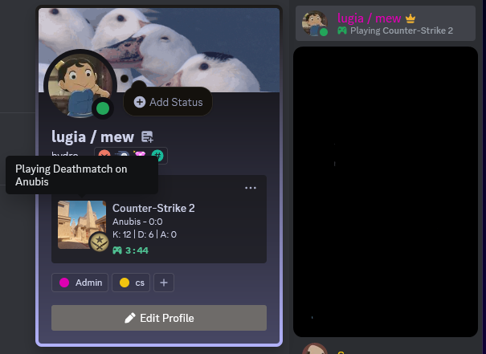

# CS-RichPresence
Discord Rich Presence for CS2 that shows what map you're playing, K/D/A and game mode.

I worked on this while practicing my Python so the coding practices may not be the most optimized. I’d really appreciate feedback on how I’d optimize/change the code for the better so feel free to open PRs/issues.  

Here’s an example of how it will look in game  

Instructions:  
install requirements.txt  
copy over “gamestate_integration_consolesample.cfg” to your “Counter-Strike Global Offensive\\game\\csgo\\cfg” directory  
run main.py  
launch cs2

Known issues:  
Higher than normal CPU usage when CS2 hasn’t been detected for the first time.  

Credit to [pypresence](https://github.com/qwertyquerty/pypresence) and [csgo-gsi-python](https://github.com/Erlendeikeland/csgo-gsi-python) for the foundation of the project :)
